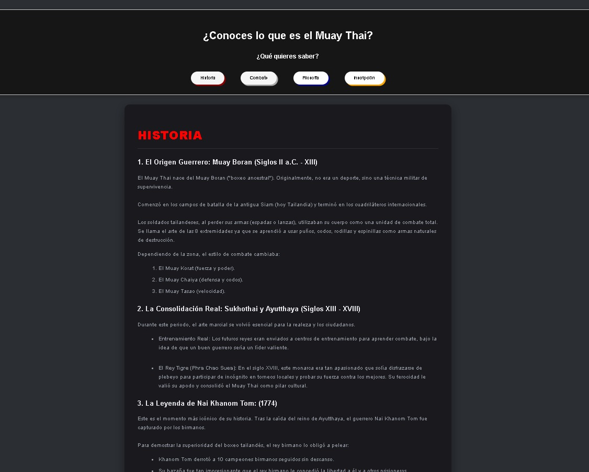
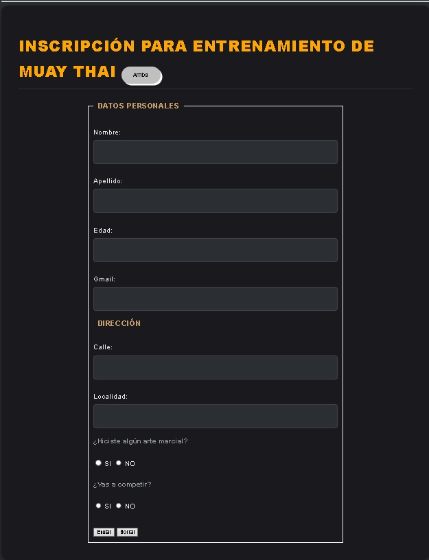

# Proyecto De Pagina 
## Descripciòn 
Mi proyecto es un pagina de un dojo donde se hace muay thai en el cual te cuenta todo sobre el arte marcial tambien te permite inscribirte a las clases 

## Paginas principales
-HISTORIA
-COMBATE
-FILOSOFIA
-iNSCRIPCION
-EQUIPAMIENTO OBLIGATORIO (NUEVO)

## Capturas del Sitio Funcionando
Aquí se puede ver cómo quedó el diseño visual final de la página web:

### Vista del Menú y Encabezado

### Vista del Formulario de Inscripción

## Tecnologías Utilizadas

HTML5
CSS
Google Fonts
JavaScript (Nuevo)

## Mejoras Visuales Incorporadas (Parte 2)
1. Estructura en Tarjetas: Organización del contenido en bloques oscuros independientes con márgenes y rellenos cómodos para la lectura.

2. Uso de Variables (`:root`): Implementación del estante global de colores para un mantenimiento más limpio del código.

3. Efecto de Botones Interactivos: Botones con sombras sólidas de colores que simulan un hundimiento físico y cambian el color de su texto de manera elástica en estado `:hover`.

4. Títulos Personalizados: Aplicación de colores específicos independientes para cada título de sección mediante la regla `:nth-of-type()`.

5. Formulario Prolijo: Alineación perfecta de las barras de entrada de texto usando la propiedad `box-sizing: border-box` para evitar desbordes.

6. Diseño Adaptable (Responsive): Uso de *Media Queries* para reordenar el menú en forma vertical cuando la página se abre en la pantalla de un celular.

## Funcionalidades Interactivas Incorporadas (Parte 3)
1. Validacion de formulario: Logica estructurada mediante bloques (`try...catch`) que evalua de forma independiente que los campos de texto y botones tipo radio no esten vacios, interrumpiendo el envio si hay error.

2. Uso de Arrays de Datos: Creación de una estructura de arreglo en JavaScript que almacena el equipamiento reglamentario necesario para entrenar comodamente en el dojo.

3. Manipulación Dinámica del DOM: Generación automática de elementos de lista (`li`) inyectados en tiempo real dentro del contenedor HTML sin escribir texto estático.

4. Buscador en Tiempo Real: Filtro interactivo mediante eventos de teclado que compara la entrada del usuario con los elementos del Array de equipamiento.

5. Efectos Visuales con Eventos del Mouse: Implementación de listeners para los eventos (`mouseover`) y (`mouseout`) que cambian el color, el grosor de fuente y el cursor de los elementos de manera dinámica al interactuar con ellos.

## creador 
-Arian Ulloa